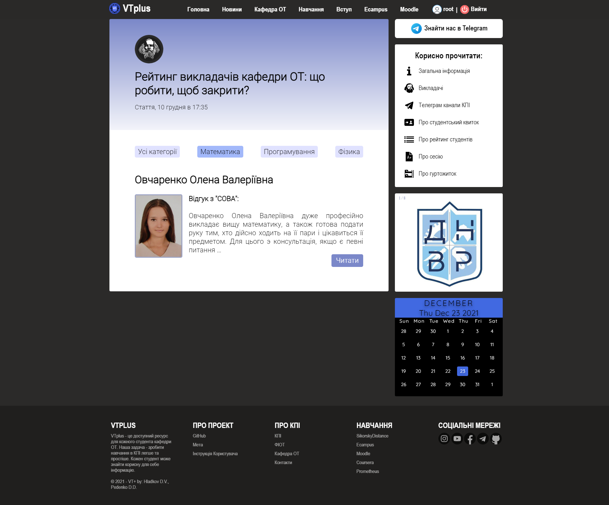

# VTplus

VTplus – это доступный ресурс для каждого студента Киевского Политехнического Инситута кафедры ВТ. Главная цель нашего проекта - сделать обучение в КПИ хоть немного легче и экономить время студентов.
	
На нашем ресурсе каждый студент сможет найти полезную для себя информацию. Мы размещаем статьи, касающиеся обучения, проживания, питания, оздоровления, решения различных проблем для студентов и много чего ещё. Мы такие же студенты, как и все, и знаем, что такое сложная студенческая жизнь, которая любит подбрасывать хлопот и неприятностей. Кто, как не студенты, могут знать все проблемы других студентов?
			
Также на VTplus вы найдете информацию о общежитии, льготах, плюсах студенческого билета, экономии денег и немало важно - получите исчерпывающую информацию о каждом преподавателе (теперь не нужно писать старшекурсникам и заваливать их вопросами о каждом преподавателе и его предмете).

В будущем планируется развитие проекта: добавление ролей авторизированным пользователям, возможность создавать список дедлайнов и дз по предметам, а также возможность добавлять статьи не только администраторам ресурса, но и обычным юзерам

# Установка

Сайт находится ещё в стадии разработки, но уже имеет функионал для корректного использования.

1. Клонируем
```
git clone https://github.com/hladnord/VTplus
```
2. Устанавливаем всё необходимое
```
pip install -r requirements.txt
```
3. Запускаем
```
python manage.py runserver
```

# Контакты 

- Гладков Даніїл ІО-92     tg: @hladkovdaniil    email:   gladkovdaniil.kpi.io92@gmail.com
- Педенко Данило ІО-92     tg: @ChoogaBM       email: pedenko.danil@gmail.com

# Скриншоты
## Головна сторінка сайту


## Сторінка "ВПП" категорії "Кафедра ОТ"


## Сторінка "Диплом" категорії "Навчання"


## Сторінка "Телеграм канали КПІ" категорії "Навчання"


## Сторінка "Викладачі" категорії "Кафедра ОТ"


## Сторінка про викладача Болдака А.О. категорії "Кафедра ОТ" з категорією викладання "Програмування"


## Сторінка про викладачей категорії "Кафедра ОТ" з категорією викладання "Математика"


## Сторінка про викладача Овчаренко О.В. категорії "Кафедра ОТ" з категорією викладання "Математика"


## Сторінка реєстрації користувачів


## Сторінка авторизації користувачів


## Сторінка профілю користувача


## Сторінка адмін-панелі №1


## Сторінка адмін-панелі №2


## Сторінка адмін-панелі №3

